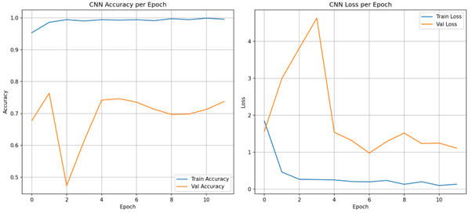

# CNN Fruit Classification

This project implements a **Convolutional Neural Network (CNN)** using TensorFlow/Keras to classify images of **Apple**, **Cherry**, and **Tomato** from the [Fruits-360 dataset](https://www.kaggle.com/moltean/fruits).  
The model uses data augmentation, batch normalization, regularization, and early stopping to improve generalization and prevent overfitting.

---

## 📌 Project Overview
The goal is to train an optimized CNN capable of accurately classifying fruit images into one of three categories:
- **Apple**
- **Cherry**
- **Tomato**

The model achieves this through:
- **Image Augmentation** for better generalization.
- **Batch Normalization** to stabilize training.
- **L1-L2 Regularization** to prevent overfitting.
- **Early Stopping** to avoid unnecessary training epochs.

---

## 📂 Dataset
**Source:** [Fruits-360 Dataset](https://www.kaggle.com/moltean/fruits)  
**Structure:**  
```
Training/
    ├── Apple/
    ├── Cherry/
    ├── Tomatoe/
```
> The dataset path must be updated in the script (`data_path` variable).

**Split:**
- **Training:** 80%
- **Validation:** 20% (set via `ImageDataGenerator`)

---

## ⚙️ Requirements
Install dependencies using:
```bash
pip install tensorflow matplotlib scikit-learn
pip install numpy
pip install matplotlib
```

---

## 🏗 Model Architecture
| Layer Type       | Parameters               | Notes                                    |
|------------------|--------------------------|------------------------------------------|
| Conv2D + BN      | 32 filters, 3×3, ReLU     | Padding = same, Batch Normalization      |
| MaxPooling2D     | 2×2                       |                                          |
| Conv2D + BN      | 64 filters, 3×3, ReLU     |                                          |
| MaxPooling2D     | 2×2                       |                                          |
| Conv2D + BN      | 128 filters, 3×3, ReLU    |                                          |
| MaxPooling2D     | 2×2                       |                                          |
| Conv2D + BN      | 256 filters, 3×3, ReLU    |                                          |
| MaxPooling2D     | 2×2                       |                                          |
| Flatten          | -                        |                                          |
| Dropout          | 0.3                       | Reduce overfitting                       |
| Dense            | 128 units, ReLU           | L1/L2 regularization                     |
| Dense (Output)   | Softmax                   | Output = 3 classes                       |

---

## 📊 Training Parameters
- **Image size:** 100×100
- **Batch size:** 32
- **Optimizer:** Adam
- **Loss:** Categorical Crossentropy
- **Epochs:** 40 (with early stopping after 5 patience epochs)

---

## 🚀 Usage
1. **Update the dataset path** in:
```python
data_path = r"C:/ML-final-project/fruits-360-3-body-problem/Training"
```
2. **Run the script**:
```bash
python cnn_fruit_classifier.py
```

---

## 📈 Results
After training, the script outputs:
- **Classification report**
- **Accuracy score**
- **Confusion matrix**
- **Training accuracy/loss plots**

Accuracy/Loss Curves:  



---

## 📜 Output Example
```
Classification Report:
              precision    recall  f1-score   support

       Apple       0.67      0.88      0.76       3198
      Cherry       0.91      0.65      0.75       1762
     Tomatoe       0.77      0.57      0.65       1999

Accuracy: 0.73
```

---

## 🔮 Possible Improvements
- Add more fruit categories for multi-class classification.
- Perform hyperparameter tuning with tools like Optuna or KerasTuner.
- Improve recall for Cherry and Tomatoe by collecting more diverse training samples and balancing class representation.
- Consider adjusting data augmentation or model architecture to better capture class-specific features and reduce misclassification.

